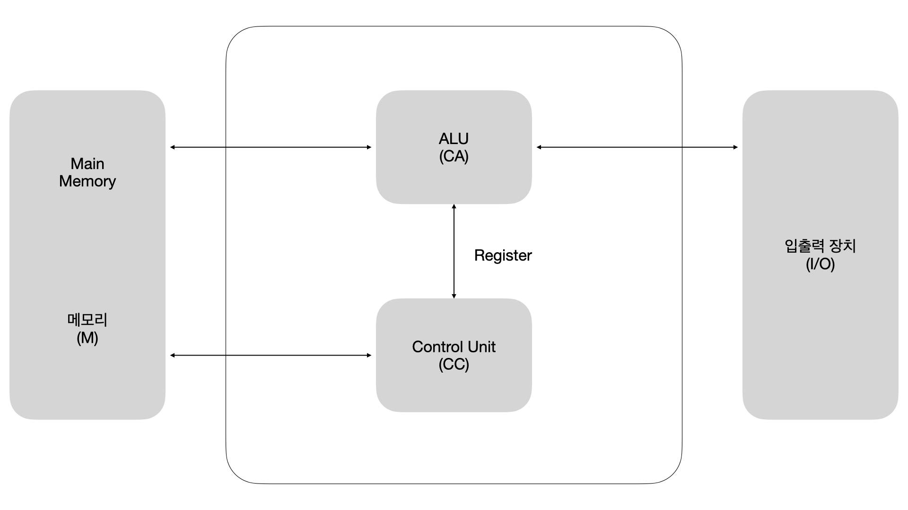
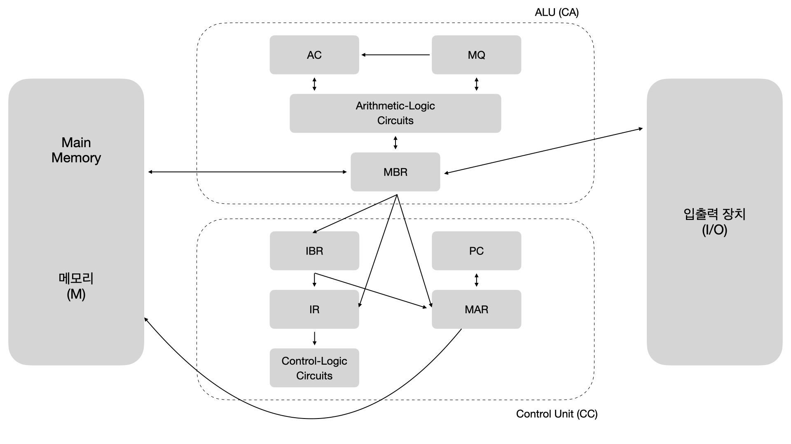

# Operating System (OS)

## CPU (Central Processing Unit, 중앙처리장치)

### CPU 구조 이해

*컴퓨터 시스템 구조*  

#### CPU 구성 요소
| 구성요소 | 상세 기능 |
|:-|:-|
|ALU(연산장치)|- 각종 산술연산들과 논리연산들을 수행하는 회로 - 산술연산: +, -, ×, ÷ - 논리연산: AND, OR, NOT, XOR|
|Register(레지스터)|- CPU 내부의 소규모 데이터나 중간 결과를 일시적으로 기억해두는 고속의 전용 영역 - 컴퓨터 기억장치 중 Access 속도가 가장 빠름|
|Control Unit(제어장치)|프로그램 코드(명령어)를 해석하고, 그것을 실행하기 위한 제어 신호들(Control Signals)을 발생시킴|
|내부 CPU 버스|ALU와 레지스터 간의 데이터 이동을 위한 경로|

#### 내부 레지스터의 종류  

*레지스터(Register)*  

| 종류 | 주요 기능 |
|:-|:-|
| **PC (Program Counter)** | 다음에 실행할 명령어의 주소를 기억하며, 명령어 실행 시마다 자동으로 증가하여 다음 주소를 가리킨다. |
| **MAR (Memory Address Register)** | 주기억장치에 접근하기 위해 **지정된 주소값**을 저장하는 레지스터로, 주소 버스를 통해 해당 메모리에 접근할 때 사용된다. |
| **MBR (Memory Buffer Register)** | 주기억장치와 CPU 사이에서 **데이터를 임시로 저장**하는 레지스터. 메모리에서 읽은 데이터 또는 메모리에 저장할 데이터를 담는다. |
| **IR (Instruction Register)** | 메모리에서 가져온 명령어(Opcode 등)를 저장하며, 제어장치가 이 명령어를 해석하여 제어 신호를 생성한다. |
| **IBR (Instruction Buffer Register)** | 하나의 메모리 워드 내에 **두 개의 명령어가 존재**할 경우, 나중 명령어를 임시 저장하는 버퍼 역할을 수행한다. |
| **AC (Accumulator)** | 연산 결과를 일시적으로 저장하는 **누산기**로, 산술 및 논리 연산의 결과값을 보관한다. |
| **MQ (Multiplier Quotient Register)** | **곱셈이나 나눗셈 연산**에서 곱수, 몫 등의 값을 저장하는 레지스터로, AC와 함께 사용된다. |
